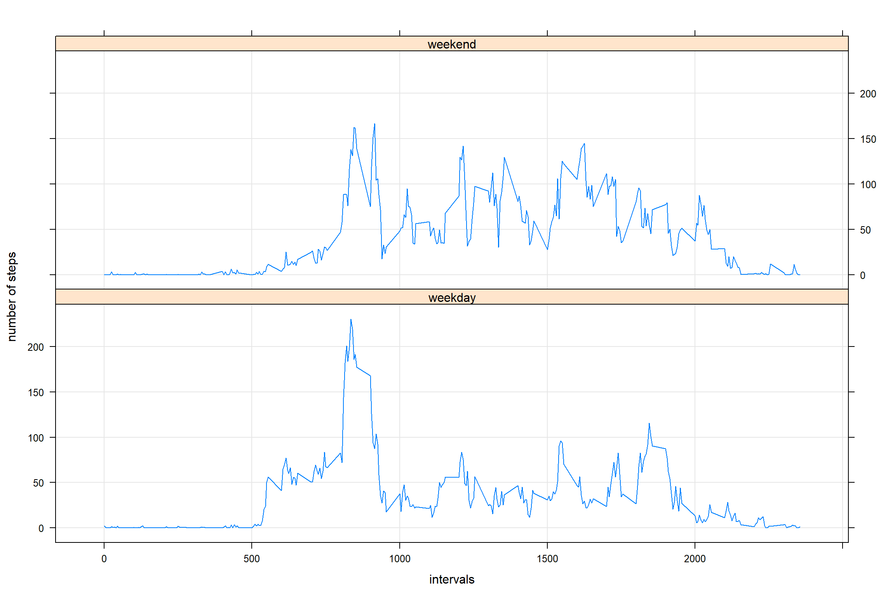

### Reading and processing dataset

```r
library(lubridate)
```

```
## 
## Attaching package: 'lubridate'
```

```
## The following object is masked from 'package:base':
## 
##     date
```

```r
Activity <-read.csv("C:/Users/rperry/Documents/Data Science Course/Data Sets/ReproducibleResearch/activity.csv")
#       convert date from factors to dates
Activity$date <- parse_date_time(Activity$date, "%Y-%m-%d")
```
### What is the distribution of the total number of steps taken per day?

This question is not particularly clear, so let's take two bites, first the frequency histogram.

```r
#       total steps per day
TotalSteps <- with(Activity, aggregate(Activity[,1],
                             by = list(date = date), sum))
#     plot total
hist(TotalSteps$x, main = "Histogram of total steps per day", col = "seagreen", xlab = "")
```


Second, the barplot of total number of steps by day, which tells a different part of the story

```r
TotalStepsDay <- aggregate(steps ~ date, rm.na = TRUE, data = Activity, FUN = sum)
plot(TotalStepsDay, type = "h",  lwd = 11, lend = "square", main = "Histogram of total steps per day", col = "seagreen")
```


### Calculating Mean and Median steps per day

#### Plain tables

```r
# mean and median
library(knitr)
A <- with(Activity, aggregate(Activity[,1],
                              by = list(date = date), mean))
B <- with(Activity, aggregate(Activity[,1],
                              by = list(date = date), median))
colnames(A) <- c("date", "mean")
colnames(B) <- c("date", "median")
kable(A)
```


|date       |       mean|
|:----------|----------:|
|2012-10-01 |         NA|
|2012-10-02 |  0.4375000|
|2012-10-03 | 39.4166667|
|2012-10-04 | 42.0694444|
|2012-10-05 | 46.1597222|
|2012-10-06 | 53.5416667|
|2012-10-07 | 38.2465278|
|2012-10-08 |         NA|
|2012-10-09 | 44.4826389|
|2012-10-10 | 34.3750000|
|2012-10-11 | 35.7777778|
|2012-10-12 | 60.3541667|
|2012-10-13 | 43.1458333|
|2012-10-14 | 52.4236111|
|2012-10-15 | 35.2048611|
|2012-10-16 | 52.3750000|
|2012-10-17 | 46.7083333|
|2012-10-18 | 34.9166667|
|2012-10-19 | 41.0729167|
|2012-10-20 | 36.0937500|
|2012-10-21 | 30.6284722|
|2012-10-22 | 46.7361111|
|2012-10-23 | 30.9652778|
|2012-10-24 | 29.0104167|
|2012-10-25 |  8.6527778|
|2012-10-26 | 23.5347222|
|2012-10-27 | 35.1354167|
|2012-10-28 | 39.7847222|
|2012-10-29 | 17.4236111|
|2012-10-30 | 34.0937500|
|2012-10-31 | 53.5208333|
|2012-11-01 |         NA|
|2012-11-02 | 36.8055556|
|2012-11-03 | 36.7048611|
|2012-11-04 |         NA|
|2012-11-05 | 36.2465278|
|2012-11-06 | 28.9375000|
|2012-11-07 | 44.7326389|
|2012-11-08 | 11.1770833|
|2012-11-09 |         NA|
|2012-11-10 |         NA|
|2012-11-11 | 43.7777778|
|2012-11-12 | 37.3784722|
|2012-11-13 | 25.4722222|
|2012-11-14 |         NA|
|2012-11-15 |  0.1423611|
|2012-11-16 | 18.8923611|
|2012-11-17 | 49.7881944|
|2012-11-18 | 52.4652778|
|2012-11-19 | 30.6979167|
|2012-11-20 | 15.5277778|
|2012-11-21 | 44.3993056|
|2012-11-22 | 70.9270833|
|2012-11-23 | 73.5902778|
|2012-11-24 | 50.2708333|
|2012-11-25 | 41.0902778|
|2012-11-26 | 38.7569444|
|2012-11-27 | 47.3819444|
|2012-11-28 | 35.3576389|
|2012-11-29 | 24.4687500|
|2012-11-30 |         NA|

```r
kable(B)
```


|date       | median|
|:----------|------:|
|2012-10-01 |     NA|
|2012-10-02 |      0|
|2012-10-03 |      0|
|2012-10-04 |      0|
|2012-10-05 |      0|
|2012-10-06 |      0|
|2012-10-07 |      0|
|2012-10-08 |     NA|
|2012-10-09 |      0|
|2012-10-10 |      0|
|2012-10-11 |      0|
|2012-10-12 |      0|
|2012-10-13 |      0|
|2012-10-14 |      0|
|2012-10-15 |      0|
|2012-10-16 |      0|
|2012-10-17 |      0|
|2012-10-18 |      0|
|2012-10-19 |      0|
|2012-10-20 |      0|
|2012-10-21 |      0|
|2012-10-22 |      0|
|2012-10-23 |      0|
|2012-10-24 |      0|
|2012-10-25 |      0|
|2012-10-26 |      0|
|2012-10-27 |      0|
|2012-10-28 |      0|
|2012-10-29 |      0|
|2012-10-30 |      0|
|2012-10-31 |      0|
|2012-11-01 |     NA|
|2012-11-02 |      0|
|2012-11-03 |      0|
|2012-11-04 |     NA|
|2012-11-05 |      0|
|2012-11-06 |      0|
|2012-11-07 |      0|
|2012-11-08 |      0|
|2012-11-09 |     NA|
|2012-11-10 |     NA|
|2012-11-11 |      0|
|2012-11-12 |      0|
|2012-11-13 |      0|
|2012-11-14 |     NA|
|2012-11-15 |      0|
|2012-11-16 |      0|
|2012-11-17 |      0|
|2012-11-18 |      0|
|2012-11-19 |      0|
|2012-11-20 |      0|
|2012-11-21 |      0|
|2012-11-22 |      0|
|2012-11-23 |      0|
|2012-11-24 |      0|
|2012-11-25 |      0|
|2012-11-26 |      0|
|2012-11-27 |      0|
|2012-11-28 |      0|
|2012-11-29 |      0|
|2012-11-30 |     NA|


### Time Series, average steps per day by interval


```r
#        the time series plot
plot(aggregate(steps ~ interval, data = Activity, FUN = mean), type = "l")
```


### Interval with maximum steps

```r
#       Maximum steps for interval
##      id that interval 
C <- aggregate(steps ~ interval, data = Activity, FUN = mean)
intervalID <- C[which.max(C$steps),1]
```
The interval with the maximum steps is 835.

### Replacing Missing Values


```r
#       working on/with NA values
#       first count the number of NAs
missingsteps <- sum((is.na(Activity$steps)))
#       missingdays <- sum(is.na(Activity$date))
#       missingint <- sum(is.na(Activity$interval)) 

#        copy the file
NewAct <- Activity
#        reuse the mean calculation
C <- aggregate(steps ~ interval, data = Activity, FUN = mean)


#       replacing  NAs
#       use the interval mean for the replacement value
for (i in 1:17568){
        # sub in mean interval for NA
        if (is.na(NewAct[i,1]) == TRUE){
                # find the right C
                intID <-NewAct[i,3]
        SubC <- subset(C, interval == intID)
        NewAct[i,1] <- SubC$steps
        }
}
       
#        check for missing values
missingsteps1 <- sum(is.na(NewAct$steps))
missingsteps1
```

```
## [1] 0
```

###  Plotting the Histogram and Recalculating the Mean and Mean with NAs Replacement
###     Histogram(s) first


```r
#       total steps per day
TotalStepsNew <- with(NewAct, aggregate(NewAct[,1],
                             by = list(date = date), sum))
#     plot total
hist(TotalStepsNew$x, main = "Histogram of total steps per day", col = "slateblue", xlab = "")
```


Here they are by day.

```r
TotalStepsNewDay <- aggregate(steps ~ date, rm.na = TRUE, data = NewAct, FUN = sum)
plot(TotalStepsNewDay, type = "h",  lwd = 11, lend = "square", main = "Histogram of total steps per day", col = "slateblue")
```


The histograms don't provide much detail. There is an increase in the frequency of the modal values in the first recalculated graph. In the second all the holes are filled in.

### Recalculating Mean and Median steps per day

#### Plain tables

```r
# mean and median
library(knitr)
A1 <- with(NewAct, aggregate(NewAct[,1],
                              by = list(date = date), mean))
B1 <- with(NewAct, aggregate(NewAct[,1],
                              by = list(date = date), median))
colnames(A1) <- c("date", "mean")
colnames(B1) <- c("date", "median")
kable(A1)
```


|date       |       mean|
|:----------|----------:|
|2012-10-01 | 37.3825996|
|2012-10-02 |  0.4375000|
|2012-10-03 | 39.4166667|
|2012-10-04 | 42.0694444|
|2012-10-05 | 46.1597222|
|2012-10-06 | 53.5416667|
|2012-10-07 | 38.2465278|
|2012-10-08 | 37.3825996|
|2012-10-09 | 44.4826389|
|2012-10-10 | 34.3750000|
|2012-10-11 | 35.7777778|
|2012-10-12 | 60.3541667|
|2012-10-13 | 43.1458333|
|2012-10-14 | 52.4236111|
|2012-10-15 | 35.2048611|
|2012-10-16 | 52.3750000|
|2012-10-17 | 46.7083333|
|2012-10-18 | 34.9166667|
|2012-10-19 | 41.0729167|
|2012-10-20 | 36.0937500|
|2012-10-21 | 30.6284722|
|2012-10-22 | 46.7361111|
|2012-10-23 | 30.9652778|
|2012-10-24 | 29.0104167|
|2012-10-25 |  8.6527778|
|2012-10-26 | 23.5347222|
|2012-10-27 | 35.1354167|
|2012-10-28 | 39.7847222|
|2012-10-29 | 17.4236111|
|2012-10-30 | 34.0937500|
|2012-10-31 | 53.5208333|
|2012-11-01 | 37.3825996|
|2012-11-02 | 36.8055556|
|2012-11-03 | 36.7048611|
|2012-11-04 | 37.3825996|
|2012-11-05 | 36.2465278|
|2012-11-06 | 28.9375000|
|2012-11-07 | 44.7326389|
|2012-11-08 | 11.1770833|
|2012-11-09 | 37.3825996|
|2012-11-10 | 37.3825996|
|2012-11-11 | 43.7777778|
|2012-11-12 | 37.3784722|
|2012-11-13 | 25.4722222|
|2012-11-14 | 37.3825996|
|2012-11-15 |  0.1423611|
|2012-11-16 | 18.8923611|
|2012-11-17 | 49.7881944|
|2012-11-18 | 52.4652778|
|2012-11-19 | 30.6979167|
|2012-11-20 | 15.5277778|
|2012-11-21 | 44.3993056|
|2012-11-22 | 70.9270833|
|2012-11-23 | 73.5902778|
|2012-11-24 | 50.2708333|
|2012-11-25 | 41.0902778|
|2012-11-26 | 38.7569444|
|2012-11-27 | 47.3819444|
|2012-11-28 | 35.3576389|
|2012-11-29 | 24.4687500|
|2012-11-30 | 37.3825996|

```r
kable(B1)
```


|date       |   median|
|:----------|--------:|
|2012-10-01 | 34.11321|
|2012-10-02 |  0.00000|
|2012-10-03 |  0.00000|
|2012-10-04 |  0.00000|
|2012-10-05 |  0.00000|
|2012-10-06 |  0.00000|
|2012-10-07 |  0.00000|
|2012-10-08 | 34.11321|
|2012-10-09 |  0.00000|
|2012-10-10 |  0.00000|
|2012-10-11 |  0.00000|
|2012-10-12 |  0.00000|
|2012-10-13 |  0.00000|
|2012-10-14 |  0.00000|
|2012-10-15 |  0.00000|
|2012-10-16 |  0.00000|
|2012-10-17 |  0.00000|
|2012-10-18 |  0.00000|
|2012-10-19 |  0.00000|
|2012-10-20 |  0.00000|
|2012-10-21 |  0.00000|
|2012-10-22 |  0.00000|
|2012-10-23 |  0.00000|
|2012-10-24 |  0.00000|
|2012-10-25 |  0.00000|
|2012-10-26 |  0.00000|
|2012-10-27 |  0.00000|
|2012-10-28 |  0.00000|
|2012-10-29 |  0.00000|
|2012-10-30 |  0.00000|
|2012-10-31 |  0.00000|
|2012-11-01 | 34.11321|
|2012-11-02 |  0.00000|
|2012-11-03 |  0.00000|
|2012-11-04 | 34.11321|
|2012-11-05 |  0.00000|
|2012-11-06 |  0.00000|
|2012-11-07 |  0.00000|
|2012-11-08 |  0.00000|
|2012-11-09 | 34.11321|
|2012-11-10 | 34.11321|
|2012-11-11 |  0.00000|
|2012-11-12 |  0.00000|
|2012-11-13 |  0.00000|
|2012-11-14 | 34.11321|
|2012-11-15 |  0.00000|
|2012-11-16 |  0.00000|
|2012-11-17 |  0.00000|
|2012-11-18 |  0.00000|
|2012-11-19 |  0.00000|
|2012-11-20 |  0.00000|
|2012-11-21 |  0.00000|
|2012-11-22 |  0.00000|
|2012-11-23 |  0.00000|
|2012-11-24 |  0.00000|
|2012-11-25 |  0.00000|
|2012-11-26 |  0.00000|
|2012-11-27 |  0.00000|
|2012-11-28 |  0.00000|
|2012-11-29 |  0.00000|
|2012-11-30 | 34.11321|

### Comparing the overall means and medians

It's hard to do the pairwise comparision on these table by eyeball. A better comparison might be between the means and median values for the overall data set and the one with the NAs replaced. 

```r
#       mean and median original
Omean <- mean(Activity$steps, na.rm = TRUE)
Omedian <- median(Activity$steps, na.rm = TRUE)

#       mean and median new
Nmean <- mean(NewAct$steps)
Nmedian <- median(NewAct$steps)
```

The original mean was 37.3825996 compared with the new mean 37.3825996. The medians likewise, old = 0, new 0. Using the mean steps per interval to replace the NA values, did not change the summary stats.

### Weekdays and Weekends


Using the data set with the NAs replaced, the final set of plots looks at whether the days of the week, weekend versus weekday, makes a difference in the mean number of steps taken at different times of the day.

```r
#       using the new data set get the weekend and weekdays separated using a new variable
#       Create a new factor variable in the dataset with two levels - "weekday" and "weekend" 
#       indicating whether a given date is a weekday or weekend day.
wkDay <- c("Monday", "Tuesday","Wednesday","Thursday","Friday")
NewAct$days <- NA
#       how this should work, check the date, if it's a weekday, then call the new variable weekday, otherwise weekend.
for (i in 1:17568){
        if (weekdays(NewAct[i,2]) %in% wkDay){
                NewAct[i,4] <-c("weekday")
        } else
        {
        NewAct[i,4] <-c("weekend")
        }
}             

#       plotting weekday and weekend time series
#        subset first
workdays <-subset(NewAct, days == "weekday")
workdays <- aggregate(steps ~ interval, data = workdays, FUN = mean)
playdays <- subset(NewAct, days == "weekend")
playdays <- aggregate(steps ~ interval, data = playdays, FUN = mean)


#puting the means together for better plotting
workdays$day <- c("weekday")
playdays$day <- c("weekend")
daydiff <-rbind(workdays, playdays)

# now to panel them and give them the right titles
library(lattice)
xyplot(steps ~ interval | day, daydiff,
       grid = TRUE, type = "l", layout = c(1,2), xlab = "intervals", ylab = "number of steps")
```



As you can see, there's a morning spike in steps, presumably people going to work on weekdays, which is not visible in the weekend plot.

